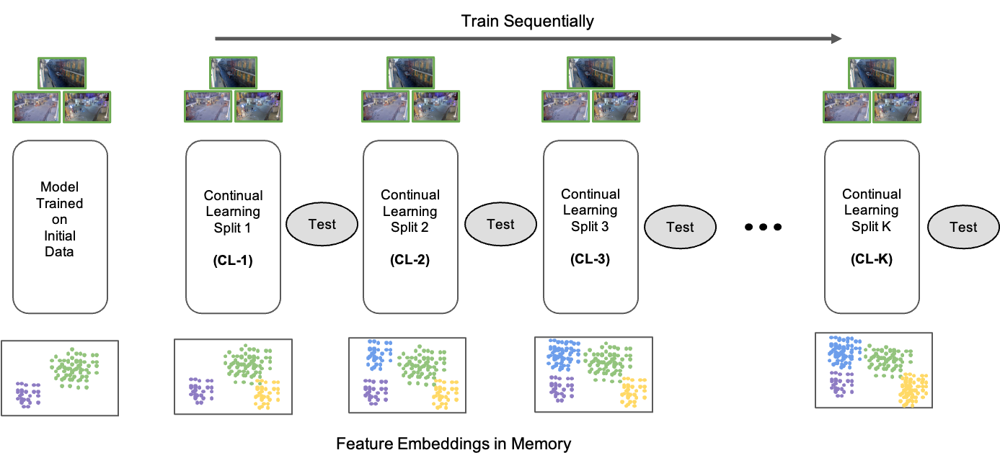
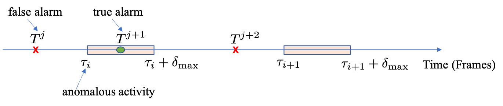

# NOLA
Repository for the NOLA dataset proposed in our paper Rethinking Video Anomaly Detection-A Continual Learning Approach.



It is implemented in tensorflow. Please follow the instructions to run the code.

## 1. Installation (Anaconda with python3.6 installation is recommended)
* Install 3rd-package dependencies of python (listed in requirements.txt)
```
numpy==1.14.1
scipy==1.0.0
matplotlib==2.1.2
tensorflow-gpu==1.4.1
tensorflow==1.4.1
Pillow==5.0.0
pypng==0.0.18
scikit_learn==0.19.1
opencv-python==3.2.0.6
```

```shell
pip install -r requirements.txt

pip install tensorflow-gpu==1.4.1
```
* Other libraries
```code
CUDA 8.0
Cudnn 6.0
Ubuntu 14.04 or 16.04, Centos 7 and other distributions.
```
## 2. Download datasets
Please manually download the dataset from https://usf.box.com/s/urj8c65lrell37oi2dzuno47jgout810 and extract it, and move them in to **Data** folder.

## 3. Proposed Average Precision Delay Metric



## 4. Testing on saved models
